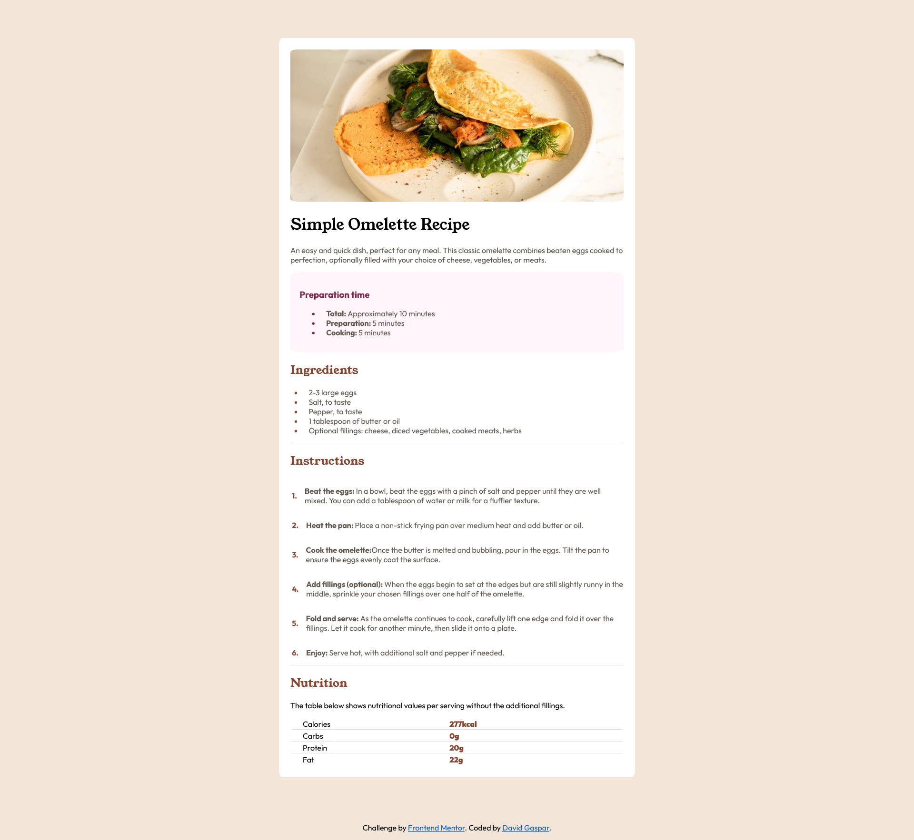

# Frontend Mentor - Recipe page solution

This is a solution to the [Recipe page challenge on Frontend Mentor](https://www.frontendmentor.io/learning-paths/getting-started-on-frontend-mentor-XJhRWRREZd/steps/6633444e20fb35b1b6726a5b/challenge/start).

## Table of contents

- [Overview](#overview)
  - [Screenshot](#screenshot)
  - [Links](#links)
- [My process](#my-process)
  - [Built with](#built-with)
- [Author](#author)

## Overview

### Screenshot

### Links

- Solution URL: [Solution URL ](https://github.com/Dav1dGP/Projects-FrontendMentor/tree/master/recipe-page-main)
- Live Site URL: [Live site URL](https://663df6d8b3295fec7bf3fccb--hilarious-gecko-8b2b4a.netlify.app/)

## My process

### Built with

- Semantic HTML5 markup
- CSS custom properties

## Author

- Frontend Mentor - [@Dav1dGP](https://www.frontendmentor.io/profile/Dav1dGP)