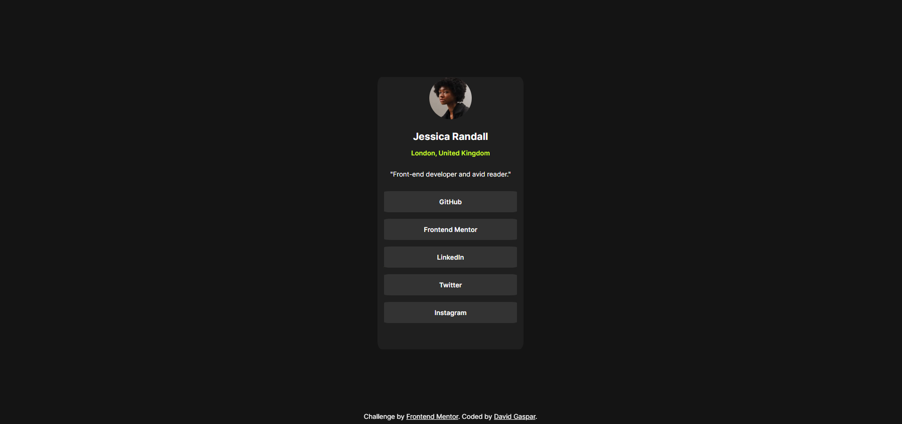

# Frontend Mentor - Blog preview card solution

This is a solution to the [Blog preview card challenge on Frontend Mentor](https://www.frontendmentor.io/challenges/blog-preview-card-ckPaj01IcS).

## Table of contents

- [Overview](#overview)
  - [Screenshot](#screenshot)
  - [Links](#links)
- [My process](#my-process)
  - [Built with](#built-with)
- [Author](#author)

## Overview

### Screenshot

### Links

- Solution URL: [Solution URL ](https://github.com/Dav1dGP/Projects-FrontendMentor/tree/master/blog-preview-card-main)
- Live Site URL: [Live site URL](https://6635062a783c730f4bf728de--thriving-puppy-f77eff.netlify.app/)

## My process

### Built with

- Semantic HTML5 markup
- CSS custom properties

## Author

- Frontend Mentor - [@Dav1dGP](https://www.frontendmentor.io/profile/Dav1dGP)